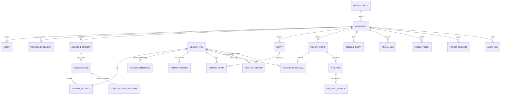

# 概念结构设计与 E-R 图

## 1. 概念模型分层

| 层次 | 实体 |
|---|---|
| 源文档层 | SourceDocument、SourceChunk、Session、Message |
| 记忆层 | MemoryItem、MemoryRevision、MemoryScene、MemoryEmbedding、SourceChunkEmbedding |
| 证据层 | MemoryEvidence、Entity、MemoryEntity |
| 表达层 | WikiPage、WikiPageRevision、TimelineEntry |
| 治理层 | AccessPolicy、RecallLog、ConflictRecord、ForgetRequest、AuditLog |

## 2. 核心实体说明

| 实体 | 核心属性 | 主键 |
|---|---|---|
| UserAccount | username、display_name、role_hint | user_id |
| Agent | name、agent_type、status | agent_id |
| Workspace | name、description、owner_user_id | workspace_id |
| WorkspaceMember | principal_type、principal_id、member_role | workspace_id + principal_type + principal_id |
| SourceDocument | title、doc_type、source_path、raw_text、checksum | doc_id |
| SourceChunk | chunk_no、chunk_text、line range | chunk_id |
| MemoryItem | memory_type、canonical_text、summary、status、confidence | memory_id |
| MemoryEmbedding | provider、model、dimension、embedding_text_hash、embedding_json | embedding_id |
| SourceChunkEmbedding | provider、model、dimension、embedding_text_hash、embedding_json | embedding_id |
| MemoryRevision | revision_no、revision_text、reason、editor | memory_id + revision_no |
| MemoryEvidence | evidence_role、weight、note | evidence_id |
| Entity | canonical_name、entity_type、description | entity_id |
| MemoryScene | scene_slug、title、summary | scene_id |
| MemorySceneCell | cell_role、sort_order、note | scene_id + memory_id |
| WikiPage | page_slug、page_type、title、needs_rebuild | page_id |
| WikiPageRevision | revision_no、frontmatter_json、body_markdown | page_id + revision_no |
| TimelineEntry | event_type、title、event_time、importance | timeline_id |
| RecallLog | query_text、result_count、context_pack_json | recall_id |
| AccessPolicy | principal、resource、effect、scope | policy_id |
| ConflictRecord | conflict_type、status、resolution_note | conflict_id |
| ForgetRequest | target_type、target_id、reason、status、reviewer | request_id |
| AuditLog | actor、action、target、before/after | audit_id |

## 3. 联系与基数

| 联系 | 类型 | 转换方式 |
|---|---|---|
| UserAccount — Workspace | 1:N | workspace.owner_user_id |
| Workspace — Agent | 1:N | agent.workspace_id |
| Workspace — UserAccount / Agent | M:N | workspace_member |
| Workspace — SourceDocument | 1:N | source_document.workspace_id |
| SourceDocument — SourceChunk | 1:N | source_chunk.doc_id |
| Session — Message | 1:N | message.session_id |
| SourceChunk — MemoryItem | M:N | memory_evidence |
| MemoryItem — MemoryEmbedding | 1:N | memory_embedding |
| SourceChunk — SourceChunkEmbedding | 1:N | source_chunk_embedding |
| MemoryItem — MemoryRevision | 1:N | memory_revision.memory_id |
| MemoryScene — MemoryItem | M:N | memory_scene_cell |
| MemoryItem — Entity | M:N | memory_entity |
| WikiPage — WikiPageRevision | 1:N | wiki_page_revision |
| WikiPage — MemoryScene | N:1 | wiki_page.generated_from_scene_id |
| MemoryItem — ConflictRecord | 1:N | conflict_record.left/right |

## 4. Mermaid E-R 图



该 Mermaid ER 图是 repo 内的可审源文件。最终提交时应从本段导出
SVG/PNG 到 `docs/final-assets/`；渲染工具可用 Mermaid CLI、HTML/SVG
脚本或 draw.io，以最终图片清晰度为准。

## 5. 设计说明

这个 E-R 设计体现了 MemoryBase 的核心生命周期：

```text
ingest → extract → evidence → revise → retrieve → govern → project → forget
```

其中 SourceDocument 和 SourceChunk 负责原始来源，MemoryItem 负责长期记忆，MemoryEvidence 负责可追溯性，MemoryRevision 和 AuditLog 负责版本与审计，WikiPage 负责人类可读表达。
