# MemoryBase：面向组织与团队的 AI-native 可追溯长期记忆数据库系统设计与实现

**课程**：CS3321 数据库技术

**小组成员**：林纪帆、杜卓轩、李昭成、王星睿

## 摘要

AI Agent 和团队协作系统会持续产生会议纪要、讨论记录、项目文档、决策、偏好等多种多样的日志文档。这些长期知识通常只保存在聊天历史或 Markdown 文件中，这导致后续很难进行结构化查询、来源追溯、权限过滤、版本审计以及选择性遗忘。面对以上困境，MemoryBase 尝试以 PostgreSQL 为事实源，把长期记忆建模为一套可查询、可追溯、可治理、可被人和 Agent 共同使用的数据库系统。

具体来说，我们的系统采用“文件—数据库双态”架构：文件侧保留 Markdown / txt source 和可导出的 Markdown Wiki，以服务人类阅读、迁移和审阅；数据库侧则使用 `source_document`、`source_chunk`、`memory_item`、`memory_evidence`、`memory_revision`、`audit_log`、`access_policy`、`wiki_page` 等关系表管理记忆生命周期，以针对具体功能。系统已实现 source 导入、chunk 切分、memory 创建与候选抽取、evidence 追溯、revision/audit 自动记录、全文检索、agent-aware visibility、冲突/遗忘治理、Wiki 投影、Graph Explorer、CLI/Agent Runtime、hybrid recall fallback 和 evaluation framework等多种功能。

我们的项目展示了完整的概念结构设计、E-R 图、关系模式转换、范式分析、物理结构设计、索引、视图、触发器、完整性约束、SQL 查询、EXPLAIN 证据，并提供带注释源程序。LongMemEval 500-case 工程评测显示当前系统在 semantic judge 下通过率为 58.4%，说明我们的系统具备长期记忆任务验证能力；当然，我们的系统也仍有值得提升之处： multi-session reasoning 和 preference following 仍是后续优化重点。

**关键词**：长期记忆数据库；PostgreSQL；Provenance；Governance；Agent Visibility；Audit Log；Hybrid Recall；Graph Explorer；Evaluation

## 1. 项目概述

### 1.1 项目定位

MemoryBase 是一个面向组织与团队的 AI-native 可追溯长期记忆数据库系统。它不是从零实现 DBMS，也不是普通 RAG 问答应用，而是数据库应用系统：以成熟关系数据库作为底座，专注于设计和实现长期记忆的关系模型、完整性约束、检索路径、权限治理、审计和人机协作入口。

系统的一句话介绍是：

> 把人类可读的 Markdown、会议纪要和项目文档，编译为人和 Agent 都能访问、可追溯、可权限控制、可审计、可版本化的长期记忆数据库。

MemoryBase 解决的核心问题包括：

| 问题 | 普通文件 / 聊天记录的局限 | MemoryBase 的处理方式 |
|---|---|---|
| 信息分散 | 文档、会议纪要、聊天记录散落各处 | `source_document` / `source_chunk` 统一导入和切分 |
| 结论难追溯 | 记忆不知道来自哪段原文 | `memory_evidence` 绑定 source chunk 和行号 |
| 修改不可审计 | 旧版本和操作者不可回放 | `memory_revision` + `audit_log` |
| 权限不可靠 | 只靠 prompt 或 UI 约定 | `access_policy` + `v_agent_visible_memory` |
| 冲突和遗忘难治理 | 删除或覆盖后缺少审批链 | `conflict_record` + `forget_request` |
| Agent 难使用 | 文件适合人读，不适合结构化上下文 | Recall / Search / Context Pack / CLI |
| 人类难审阅 | 数据库记录不适合直接阅读 | `wiki_page` / `wiki_page_revision` 导出 Markdown |

### 1.2 核心链路

系统核心数据链路为：

```text
SourceDocument
  -> SourceChunk
  -> MemoryItem
  -> MemoryEvidence
  -> MemoryRevision / AuditLog
  -> RecallLog / AccessPolicy
  -> WikiPage / WikiPageRevision
```

这条链路体现了项目的主线：长期记忆不是孤立文本，而是带来源、版本、权限、审计和表达投影的数据库对象。

### 1.3 已实现功能

核心能力（不依赖外部 LLM，也不依赖向量数据库）：

- 导入 Markdown / txt source；
- 自动切分 source chunk；
- 创建、编辑、归档 memory；
- 绑定 memory evidence；
- 记录 memory revision 和 audit log；
- 关键词 / 全文检索；
- Markdown Wiki 导出；
- 前端基础页面和 SQL 演示数据。

扩展能力包括：

- agent-aware visibility 和 policy 过滤；
- ConflictRecord 冲突治理；
- ForgetRequest 遗忘/归档审批；
- rule-based + optional LLM candidate memory extraction；
- local hashing embedding cache 与 hybrid recall fallback；
- Graph Explorer（PostgreSQL preview + 可选 Neo4j sync）；
- CLI / Agent Runtime sessions、observe、remember、search、recall；
- evaluation framework（LoCoMo / LongMemEval / MemoryAgentBench 等 adapter）。

### 1.4 报告材料入口

如果想对本项目有更全面了解，可以参考以下报告：

| 材料 | 用途 |
|---|---|
| `docs/00-project-overview.md` | 项目总览和核心链路 |
| `docs/gap2-research-landscape.md` | 研究现状分析 |
| `docs/01-requirements.md` | 需求分析 |
| `docs/02-data-flow.md` | 数据流图 |
| `docs/03-data-dictionary.md` | 数据字典 |
| `docs/04-er-design.md` / `docs/final-assets/diagrams/` | ER 和流程图 |
| `docs/05-logical-design.md` / `docs/normalization.md` | 逻辑结构和范式分析 |
| `docs/06-physical-design.md` / `docs/index-rationale.md` / `docs/explain-analyze.md` | 物理设计、索引和 EXPLAIN |
| `docs/07-system-architecture.md` / `docs/08-api-design.md` / `docs/09-module-ipo.md` | 系统架构、API 和模块 IPO |
| `docs/10-test-plan.md` / `docs/final-assets/screenshots/` | 测试与截图证据 |
| `docs/gap3-innovation-analysis.md` | 创新点展开 |
| `docs/gap6-contribution-ledger.md` | 小组分工和个人贡献 |
| `docs/gap8-source-sql-appendix-map.md` | 带注释 SQL / 高级语言源程序附录 |

## 2. 研究现状分析

### 2.1 传统 RAG 与向量检索

Retrieval-Augmented Generation（RAG）通过“文档切分、embedding、向量召回、上下文拼接”增强 LLM 对外部知识的访问能力。它的优势是实现快、语义召回强、生态成熟，LangChain、LlamaIndex 等框架也降低了工程门槛。

但普通 RAG 更关注 chunk 检索和回答效果，较少把 chunk、memory、evidence、revision、audit、policy、wiki projection 建模为有完整生命周期的业务对象。它能返回相关片段，却不一定能回答：这条 memory 来自哪份 source？谁修改过？Agent 是否有权限看？source 被遗忘后是否还会被召回？一次 hybrid recall 为什么降级到 keyword？

MemoryBase 保留 RAG 的检索思想，但以 PostgreSQL 关系模型为核心：source、chunk、memory、evidence、recall log 和 audit 都是可查询对象；而embedding cache 只是可选增强，不是唯一事实源。

### 2.2 Agent 长期记忆系统

MemGPT / Letta、Mem0、MemoryBank、LongMem、Generative Agents 等系统说明长期记忆已经成为 Agent 基础设施。它们强调 core memory、archival memory、动态抽取、合并、检索和跨会话状态维护。

这些工作证明 Agent 确实需要长期记忆，但从数据库课程和组织治理角度看，它们通常更关注“模型是否记得并用上”，而不是 schema、外键、范式、触发器、审计链、权限视图和 SQL 可验证性。MemoryBase 的差异化是把 Agent 记忆问题落到数据库系统：Agent 可以用 CLI/API 做 recall、search、observe、remember，但每次写入和召回都落入可约束、可审计、可复现的数据库结构。

### 2.3 产品化记忆和企业知识库

ChatGPT Memory 代表消费者产品中的记忆能力，用户可以管理 saved memories 和 reference chat history；Confluence AI / Atlassian Rovo 与 Notion AI Enterprise Search 代表企业知识管理中的 AI search、chat、agents 和 workspace automation；Obsidian / Logseq 则代表本地文件型知识库。

这些产品既说明长期记忆和知识管理是实际需求，也显示一大问题：这些产品大多不开放底层关系 schema、触发器、SQL EXPLAIN、审计表和多租户权限策略等内容。MemoryBase 吸收了它们在人类可读、wiki、搜索和引用方面的优点，同时也满足数据库课程所要求的可建模、可约束、可审计和可复现。

### 2.4 长期记忆评测与 GraphRAG

LoCoMo、LongMemEval、MemoryAgentBench 等 benchmark 从多 session、长期对话、时间推理、信息更新、选择性遗忘等角度评估 memory agent 能力。GraphRAG 则强调在 chunk / vector 之外构建实体关系图和社区摘要，提升跨文档关系理解。

MemoryBase 已接入 evaluation framework，并实现 Graph Explorer。graph 用于 provenance 和 governance 可视化，PostgreSQL 是权威事实源。当前 LongMemEval 结果显示系统已有长期记忆工程验证路径。

### 2.5 现有方案的共同不足

综合来看，现有路线存在四类不足：

1. 可追溯性不足：能召回结果，但不能稳定说明 memory 与 source、chunk、revision、approval 的关系。
2. 关系建模不足：向量库擅长相似度，但不擅长表达 evidence、policy、audit、forget request 等关系。
3. 治理能力不足：组织场景需要权限、冲突、遗忘、归档、审计和多角色访问。
4. 课程可验证性不足：黑盒 AI 工具难以展示 E-R 图、关系模式、范式、索引、视图、触发器和 EXPLAIN。

MemoryBase 的切入点正是把长期记忆作为数据库应用系统来建模。

## 3. 需求分析

### 3.1 用户角色

| 角色 | 使用目标 | 主要操作 | 权限边界 |
|---|---|---|---|
| 普通用户 | 搜索项目记忆、查看 source、阅读 Wiki | 搜索、查看、导出 | 默认只看 public/project 范围 |
| 小组成员 | 维护课程项目记忆 | 导入 source、创建/编辑 memory、处理 conflict | 不能绕过 workspace 和 policy |
| Agent | 基于权限读取 context pack，写入观察和记忆 | recall、search、observe、remember | 必须经过 agent visibility 过滤 |
| 管理员 | 管理权限、审计、冲突和遗忘 | policy、audit、conflict、forget request | 操作写入 audit |
| 访客 / 只读用户 | 查看公开 Wiki 或演示结果 | 浏览和搜索公开内容 | 不能编辑或查看审计详情 |

### 3.2 功能需求

| 模块 | 功能 | 优先级 |
|---|---|---|
| Workspace 基础配置 | 初始化 workspace、维护成员和边界 | P0 |
| Source 导入 | 导入 Markdown / txt，切分 chunk | P0 |
| Memory 管理 | 创建、编辑、删除 memory | P0 |
| Evidence 追溯 | memory 绑定 source chunk | P0 |
| Revision / Audit | 修改自动记录版本和审计 | P0 |
| Recall 检索 | keyword / FTS / hybrid recall | P0/P1 |
| Markdown Wiki | 导出 WikiPage 和版本 | P0 |
| AccessPolicy | Agent 权限过滤 | P1 |
| ConflictRecord | 冲突记忆治理 | P1 |
| ForgetRequest | 遗忘与归档审批 | P1 |
| Graph Explorer | 展示 source/memory/evidence/wiki/governance 关系 | P1 |
| Agent Runtime / CLI | sessions、observe、remember、search、recall | P1 |
| Evaluation | 长期记忆评测适配器、指标和报告 | P1 |
| QA | 基于 recall context 的可选 LLM answer | P2 |

### 3.3 非功能需求

| 类别 | 要求 | 实现方式 |
|---|---|---|
| 数据完整性 | 不允许孤立 evidence、revision | 主键、外键、UNIQUE、CHECK |
| 可追溯性 | 每条 memory 可追到 source chunk | `memory_evidence`、`v_memory_with_source` |
| 权限控制 | Agent 只能看授权范围 | `access_policy`、`v_agent_visible_memory` |
| 可审计性 | 关键操作可回放 | `audit_log`、trigger、before/after JSON |
| 可降级性 | 没有 LLM / embedding 也能演示 | rule-based extraction、keyword fallback |
| 可演示性 | 5-8 分钟讲清核心闭环 | seed + governance fixture + screenshot assets |
| 性能需求 | 课程规模下秒级查询 | B+ tree、GIN、BRIN、covering index |

## 4. 数据流设计

### 4.1 0 层数据流图

外部实体包括普通用户/小组成员、Agent、管理员、Markdown/会议纪要文件和 Markdown Wiki 文件系统。核心内容是 MemoryBase 长期记忆数据库系统。主要数据存储包括 Source Store、Memory Store、Governance Store、Wiki Store 和 Audit Store。

```text
User / Agent / Admin / Source files
        -> MemoryBase
        -> Source Store / Memory Store / Governance Store / Wiki Store / Audit Store
        -> Markdown Wiki / Context Pack / UI / SQL evidence
```

### 4.2 1 层数据流

```text
Markdown / txt 文件
  -> Source Ingest
  -> SourceDocument / SourceChunk
  -> Memory Extract / Manual Edit
  -> MemoryItem / MemoryEvidence
  -> Semantic Organization
  -> Entity / MemoryScene
  -> Recall Search
  -> Context Pack
  -> Wiki Export
  -> WikiPage / WikiPageRevision

关键操作
  -> Governance
  -> AuditLog / MemoryRevision / RecallLog / AccessPolicy
```

### 4.3 关键 2 层流程

Source 导入流程：

```text
用户上传文件
  -> 校验文件类型
  -> 计算 checksum
  -> 保存 SourceDocument
  -> 按行数 / token 切分
  -> 保存 SourceChunk
  -> 通过 imported_at / imported_by_user_id 保留导入元数据
```

Recall 检索流程：

```text
用户 / Agent 输入 query
  -> 解析 query 和过滤条件
  -> 应用 public/project 或 v_agent_visible_memory 过滤
  -> 查询 SourceChunk FTS / trigram
  -> 查询 MemoryItem 文本匹配
  -> 可选查询 MemoryEmbedding / SourceChunkEmbedding
  -> Join MemoryEvidence / SourceChunk / SourceDocument
  -> 返回 memory + evidence + source
  -> 写入 RecallLog
```

Wiki 导出流程：

```text
选择 scene / memory / workspace
  -> 查询 MemoryItem
  -> 查询 MemoryEvidence
  -> 查询 SourceChunk
  -> 生成 Markdown frontmatter
  -> 写入 WikiPage
  -> 写入 WikiPageRevision
  -> 导出 data/markdown_wiki/
```

## 5. 数据字典

### 5.1 核心数据项

| 数据项 | 含义 | 类型 | 约束示例 |
|---|---|---|---|
| `user_id` | 用户编号 | UUID | PK |
| `agent_id` | Agent 编号 | UUID | PK |
| `workspace_id` | 工作区编号 | UUID | PK / FK |
| `doc_id` | 源文档编号 | UUID | PK |
| `chunk_id` | 文档块编号 | UUID | PK |
| `memory_id` | 记忆项编号 | UUID | PK |
| `evidence_id` | 证据编号 | UUID | PK |
| `revision_no` | 版本号 | INT | 与 memory/page 组成复合 PK |
| `audit_id` | 审计日志编号 | UUID | PK |
| `access_level` | 访问范围 | VARCHAR | public/project/team/private |
| `memory_type` | 记忆类型 | VARCHAR | episodic/semantic/fact/profile/procedural/decision/preference/task/risk/constraint/policy/summary |
| `status` | 记忆状态 | VARCHAR | candidate/active/archived/forgotten/superseded/rejected/conflicted |

### 5.2 主要数据结构

| 数据结构 | 组成 | 说明 |
|---|---|---|
| `SourceDocument` | doc_id、workspace_id、doc_type、title、raw_text、checksum、status、imported_at | 原始文档 |
| `SourceChunk` | chunk_id、doc_id、chunk_no、chunk_text、line range、search_vector | 文档切块 |
| `MemoryItem` | memory_id、workspace_id、memory_type、canonical_text、status、access_level、valid_from/valid_to | 长期记忆核心 |
| `MemoryEvidence` | evidence_id、memory_id、chunk_id、role、weight、note | 记忆来源证据 |
| `MemoryRevision` | memory_id、revision_no、text、summary、reason、editor | 记忆版本历史 |
| `AuditLog` | actor、action、target、before_json、after_json、created_at | 操作审计 |
| `AccessPolicy` | principal、resource、effect、scope | 权限策略 |
| `WikiPage` / `WikiPageRevision` | page metadata + markdown body | 人类可读投影 |
| `MemoryEmbedding` / `SourceChunkEmbedding` | provider、model、dimension、embedding_json、hash | 可选向量缓存 |

完整数据字典见 `docs/03-data-dictionary.md`。

## 6. 概念结构设计与 E-R 图

### 6.1 概念分层

| 层次 | 主要实体 | 作用 |
|---|---|---|
| 源文档层 | SourceDocument、SourceChunk、AgentSession、Message | 保存原始输入 |
| 记忆层 | MemoryItem、MemoryRevision、MemoryScene、MemoryEmbedding | 保存长期记忆、版本和可选向量 |
| 证据层 | MemoryEvidence、Entity、MemoryEntity | 绑定记忆与来源，支持语义组织 |
| 表达层 | WikiPage、WikiPageRevision、TimelineEntry | 生成 Wiki 和时间线 |
| 治理层 | AccessPolicy、RecallLog、ConflictRecord、ForgetRequest、AuditLog | 权限、审计、冲突、遗忘 |

### 6.2 核心 E-R 图


完整 25 实体 ER 图见 `docs/final-assets/diagrams/02-er-full.svg`。核心关系包括：

| 联系 | 类型 | 转换方式 |
|---|---|---|
| Workspace - SourceDocument | 1:N | `source_document.workspace_id` |
| SourceDocument - SourceChunk | 1:N | `source_chunk.doc_id` |
| SourceChunk - MemoryItem | M:N | `memory_evidence` |
| MemoryItem - MemoryRevision | 1:N | `memory_revision.memory_id` |
| MemoryItem - Entity | M:N | `memory_entity` |
| MemoryScene - MemoryItem | M:N | `memory_scene_cell` |
| WikiPage - WikiPageRevision | 1:N | `wiki_page_revision` |
| Workspace - AccessPolicy / AuditLog / RecallLog | 1:N | workspace-scoped governance tables |

### 6.3 设计说明

E-R 设计围绕以下生命周期组织：

```text
ingest -> extract -> evidence -> revise -> retrieve -> govern -> project -> forget
```

其中 `MemoryEvidence` 是最关键的 M:N 关联：一条 memory 可以由多个 source chunk 支撑，一个 source chunk 也可以支撑多个 memory。它让系统从“文本检索”升级为“证据链建模”。

## 7. 逻辑结构设计与范式分析

### 7.1 关系模式

主要关系模式包括：

```text
UserAccount(user_id PK, username UNIQUE, display_name, email UNIQUE, role_hint, created_at, updated_at)

Workspace(workspace_id PK, slug UNIQUE, name, description, scope_type, owner_user_id FK, created_at, updated_at)

Agent(agent_id PK, workspace_id FK, name, agent_type, status, owner_user_id FK, created_at)

SourceDocument(doc_id PK, workspace_id FK, session_id FK, doc_type, title, source_path, raw_text, checksum, status, forgotten_at, imported_by_user_id FK, imported_at)

SourceChunk(chunk_id PK, doc_id FK, chunk_no, chunk_text, start_line, end_line, token_count, search_text_zh, search_vector, UNIQUE(doc_id, chunk_no))

MemoryItem(memory_id PK, workspace_id FK, created_from_doc_id FK, memory_type, canonical_text, summary, search_text_zh, search_vector, confidence, importance, status, access_level, owner_user_id FK, owner_agent_id FK, valid_from, valid_to, superseded_by_memory_id FK, current_revision_no, created_at, updated_at)

MemoryEvidence(evidence_id PK, memory_id FK, chunk_id FK, evidence_role, weight, note, created_at, UNIQUE(memory_id, chunk_id, evidence_role))

MemoryRevision(memory_id FK, revision_no, revision_text, revision_summary, revision_reason, editor_type, editor_id, created_at, PK(memory_id, revision_no))

WikiPage(page_id PK, workspace_id FK, page_slug, page_type, title, current_revision_no, generated_from_scene_id FK, generated_from_memory_id FK, needs_rebuild, status, forgotten_at, created_at, updated_at)

WikiPageRevision(page_id FK, revision_no, frontmatter_json, body_markdown, generated_by, created_at, PK(page_id, revision_no))

AccessPolicy(policy_id PK, workspace_id FK, principal_type, principal_id, resource_type, resource_scope, effect, predicate_json, created_at)

ConflictRecord(conflict_id PK, workspace_id FK, left_memory_id FK, right_memory_id FK, conflict_type, status, resolution_note, resolved_by_actor_type, resolved_by_actor_id, resolved_at, created_at, updated_at)

ForgetRequest(request_id PK, workspace_id FK, target_type, target_id, requester_user_id FK, reviewed_by_user_id FK, reason, status, requested_at, resolved_at)

AuditLog(audit_id PK, workspace_id FK, actor_type, actor_id, action_type, target_type, target_id, before_json, after_json, created_at)
```

完整关系模式见 `docs/05-logical-design.md`。

### 7.2 E-R 到关系模型转换

1:N 关系通过在 N 端保存外键实现，例如 `source_document.workspace_id`、`source_chunk.doc_id`、`memory_revision.memory_id`。M:N 关系通过中间表实现，例如 `memory_evidence`、`memory_entity`、`memory_scene_cell`。版本化实体采用复合主键，例如 `memory_revision(memory_id, revision_no)` 和 `wiki_page_revision(page_id, revision_no)`。

### 7.3 范式分析

核心业务表以 3NF / BCNF 为主：

- 每张表有明确主键或复合主键；
- 非主属性直接依赖候选键；
- M:N 关系拆分为关联表；
- 版本内容从主表拆到 revision 表；
- 权限、审计、冲突、遗忘独立成治理表。

少数受控反规范化是有意设计：

| 字段 | 所在表 | 原因 | 一致性维护 |
|---|---|---|---|
| `search_vector` | `memory_item` / `source_chunk` | 支撑 GIN 全文检索 | GENERATED column |
| `current_revision_no` | `memory_item` / `wiki_page` | 快速读取当前版本 | trigger |
| `needs_rebuild` | `wiki_page` | Wiki dirty bit | trigger |
| `workspace_id` | `memory_entity` / `memory_scene_cell` | 支撑复合 FK 保证同租户 | FK constraint |
| `embedding_json` | embedding tables | 缓存模型输出向量 | provider/model/hash 去重 |

完整函数依赖和范式判定见 `docs/normalization.md`。

## 8. 物理结构设计

### 8.1 数据库选择

主数据库采用 PostgreSQL。早期曾考虑 SQLite + FTS5 作为本地备选，但当前仓库脚本、测试和演示均以 PostgreSQL 为准，SQLite 不作为已交付能力。

选择 PostgreSQL 的原因：

- 支持复杂外键、CHECK、UNIQUE 和复合 FK；
- 支持 JSONB、GIN、BRIN、covering index、partial index；
- 支持 PL/pgSQL trigger；
- 适合展示数据库课程中的视图、索引、触发器和 EXPLAIN；
- 能承载多 workspace、多 user、多 agent 的组织级数据模型。

### 8.2 存储路径

```text
project-root/
  database/                 SQL schema, indexes, views, triggers, seed
  backend/app/              FastAPI backend, service/repository, CLI
  frontend/src/             React frontend
  evaluation/               benchmark adapters, metrics, runners, reports
  data/
    raw_sources/
    uploads/
    markdown_wiki/
    exports/
    backups/
    logs/
  docs/final-assets/        diagrams, screenshots, command logs
```

### 8.3 索引设计

项目使用多类 PostgreSQL 索引：

| 类别 | 用途 | 示例 |
|---|---|---|
| B+ tree / B-link tree | workspace 过滤、排序、主键/外键查找 | `idx_memory_workspace_status` |
| 复合索引 | 租户隔离 + 状态/类型筛选 | `idx_memory_workspace_type_status` |
| DESC 排序索引 | 时间线、审计、recall 最近记录 | `idx_audit_workspace_time` |
| GIN FTS | `tsvector @@ tsquery` 全文检索 | `idx_memory_fts`、`idx_source_chunk_fts` |
| GIN trigram | `ILIKE '%keyword%'` 模糊匹配 | `idx_memory_canonical_text_trgm` |
| Partial index | active hot path / NULL 策略去重 | `idx_policy_global_unique` |
| BRIN | append-only audit 时间窗分析 | `idx_audit_brin_time` |
| Covering index | index-only scan | `idx_memory_active_ranking` |
| Embedding metadata index | provider/model 缓存定位 | `idx_memory_embedding_workspace_model` |

课堂上讲的 B+ tree 与 PostgreSQL 文档中的 B-tree 名称需要解释：PostgreSQL 实际实现是 Lehman-Yao B-link tree，是 B+ tree 的并发变种，叶子层保存 row pointer 并支持范围扫描。因此报告中可把 PostgreSQL 默认 btree 作为 B+ tree 变种说明。

### 8.4 EXPLAIN 证据

`docs/explain-analyze.md` 收集了 4 个实际 EXPLAIN ANALYZE 案例：

1. `idx_memory_active_ranking` 支撑 active memory 排序，出现 `Index Only Scan` 和 `Heap Fetches: 0`；
2. Recall 主查询使用 GIN tsvector + GIN trigram，并在强制索引路径下出现 `BitmapOr`；
3. `audit_log` 时间窗聚合展示 B-tree 竞争路径与 BRIN 路径；
4. Wiki provenance join 展示多跳来源追溯。

这些案例用于证明索引不是“写在 SQL 文件里”，而是能通过 PostgreSQL planner 的真实执行计划验证。

### 8.5 视图设计

| 视图 | 作用 |
|---|---|
| `v_active_memory` | 查询 active 且仍在有效期内的 memory |
| `v_memory_with_source` | 串联 memory、evidence、chunk、source，支撑 provenance |
| `v_agent_visible_memory` | 展开每个 Agent 可见的 active memory |
| `v_project_timeline` | 串联 timeline、memory 和 source |
| `v_conflict_memory` | 展开 conflict 两端 memory |
| `v_wiki_page_sources` | 追溯 WikiPage 到 source chunk |
| `v_memory_statistics` | 按 workspace、类型、状态、访问级别统计 |
| `v_memory_recall_statistics` | 从 recall log 反查 recall_count 和 last_recalled_at |

### 8.6 触发器设计

| 触发器 | 用途 |
|---|---|
| `trg_memory_before_update` | 同一事务内递增 revision、维护状态变化前置逻辑 |
| `trg_memory_after_insert` | memory 创建后写初始 revision 和 audit |
| `trg_memory_after_update` | memory 修改后写 revision、audit，并标记 Wiki rebuild |
| `trg_memory_soft_delete` | DELETE memory 转换为 archived |
| `trg_wiki_revision_after_insert` | Wiki revision 插入后同步 current revision |
| `trg_conflict_after_insert` / `trg_conflict_after_update` | open conflict 自动标记 memory 为 conflicted，解决后恢复 |

这些触发器让 revision、audit、soft delete 和 conflict lifecycle 不依赖应用层自觉执行。

## 9. 系统总体架构

### 9.1 总体架构

```text
Human User / Admin / Agent / Evaluation Runner
             |
             v
React Frontend        MemoryBase CLI (`mb` / `memorybase`)
             \          /
              v        v
            FastAPI Backend
              |
              v
        API layer (`backend/app/api`)
              |
              v
      Service + Repository layer
              |
              v
 PostgreSQL core database  <---- optional ---->  Neo4j graph cache
              |
              v
 Markdown Wiki files / evaluation reports / screenshots
```

设计重点是 DB-first：所有长期记忆、证据、权限、版本、审计、召回日志和 Wiki 投影都先进入 PostgreSQL。前端、CLI、Agent、Graph Explorer 和 evaluation runner 是围绕同一事实源的不同入口。

### 9.2 后端模块

后端采用 FastAPI router + service/repository 分层：

| 层 | 主要文件 | 作用 |
|---|---|---|
| API layer | `backend/app/api/*.py` | 定义 HTTP endpoints 和 Pydantic contract |
| Service layer | `backend/app/services/*.py` | 封装 source、memory、recall、governance、graph、embedding、QA 等业务规则 |
| Core | `backend/app/core/*.py` | 配置、数据库连接 |
| CLI | `backend/app/cli/` | `mb` / `memorybase` command line |
| Tests | `backend/tests/` | API、service、evaluation、PostgreSQL integration 测试 |

### 9.3 前端页面

前端按工作流分组：

| 分组 | 页面 |
|---|---|
| Dashboard | `Dashboard.jsx` |
| Sources | Source list/detail |
| Memories | Memory list/detail/create/edit |
| Recall | Recall / Context Pack / QA |
| Wiki | Wiki export |
| Governance | Policies、Audit、Conflicts、ForgetRequests、Timeline |
| Runtime | Sessions、Messages、HybridSearch |
| Graph | GraphExplorer、GraphSvg |

### 9.4 CLI 与 Agent Runtime

`pyproject.toml` 暴露 `memorybase` 和 `mb` 命令。CLI 覆盖 configure、health、context、recall、search、observe、remember、sessions 和 eval。Agent 可以通过 search/recall 获取上下文，通过 observe/remember 写入消息和 memory；Agent 写回 memory 时即使没有显式 evidence，后端也会创建 `inline_agent_note` source chunk，保证 provenance 不断裂。

## 10. API 与模块 IPO

### 10.1 API 摘要

| 模块 | 端点示例 | 作用 |
|---|---|---|
| Health | `GET /api/health` | 服务和数据库状态 |
| Source | `POST /api/sources`、`GET /api/sources/{id}` | source 导入、列表、详情 |
| Memory | `POST /api/memories`、`PATCH /api/memories/{id}`、`POST /api/memories/batch` | memory CRUD、批量创建、supersession |
| Memory Extraction | `POST /api/memory-extraction/from-chunks`、`/api/memory-candidates/{memory_id}/approve` | rule-based / optional LLM candidate extraction 和审批 |
| Recall | `POST /api/recall`、`POST /api/recall/context-pack` | keyword/vector/hybrid recall 和 context pack |
| Search | `POST /api/search` | lexical search |
| Wiki | `POST /api/wiki/export` | Markdown Wiki 投影 |
| Governance | `/api/audit`、`/api/policies`、`/api/conflicts`、`/api/forget-requests`、`/api/timeline` | 审计、权限、冲突、遗忘、时间线 |
| Runtime | `/api/sessions`、`/api/observe` | Agent Runtime 会话与消息 |
| Graph | `/api/graph/*` | PostgreSQL graph preview、Neo4j sync/load |
| Embeddings / QA | `/api/embeddings/*`、`/api/qa/answer` | 可选 embedding 和 LLM answer |

完整 API 设计见 `docs/08-api-design.md`。

### 10.2 模块 IPO 表

| 模块 | Input | Process | Output |
|---|---|---|---|
| Source / Ingest | Markdown / txt / meeting text | 校验、checksum、切 chunk、生成 search text | SourceDocument、SourceChunk |
| Memory / Evidence | chunk、表单、Agent 写回 | 创建 memory、绑定 evidence、必要时创建 inline evidence | MemoryItem、MemoryEvidence |
| Memory Extraction | workspace_id、chunk_ids、max_candidates、method、llm options | rule-based 或 optional LLM 抽取、分类、创建 candidate、记录 run audit | Candidate Memory |
| Recall | query、filters、agent_id、retrieval_mode | visibility filter、FTS/trigram、可选 embedding、fallback metadata | RecallResponse、Context Pack |
| Policy / Visibility | principal、resource、scope、effect | allow/deny 策略和 per-agent visibility view | AccessPolicy、visible memory |
| Wiki | memory / scene / workspace | 渲染 Markdown frontmatter/body、写 revision | WikiPage、Markdown 文件 |
| Conflict Governance | 两条 memory | 创建/更新 conflict，trigger 标记状态 | ConflictRecord、AuditLog |
| Forget Governance | target、reason、reviewer | 审批、软遗忘、验证、审计 | ForgetRequest、target status |
| Graph Explorer | workspace_id、agent_id | PostgreSQL 构图、可选 Neo4j sync | Graph nodes/edges |
| Evaluation | dataset adapter、runner config | 加载 benchmark case、运行 metrics、生成 report | Evaluation report |

## 11. 系统实现

### 11.1 Source 到 Wiki 端到端实现

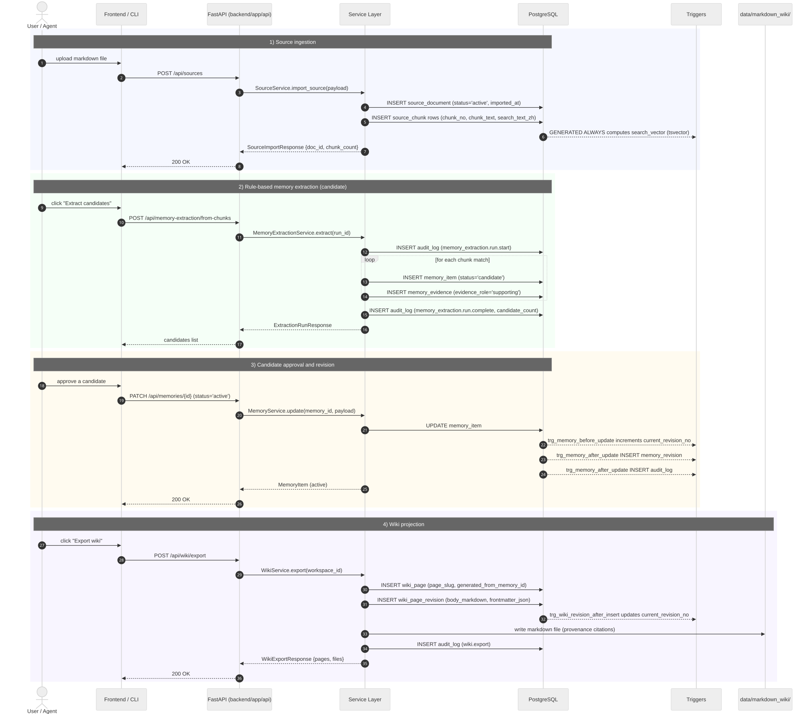

端到端链路包括：

1. `POST /api/sources` 导入原始文档；
2. service 计算 checksum 并切分 source chunk；
3. 手动创建 memory 或从 chunk 通过 rule-based / optional LLM 生成 candidate；
4. approve candidate 后进入 active lifecycle；
5. `memory_evidence` 保证 memory 可追溯；
6. trigger 写 revision / audit；
7. Wiki service 将 memory/scene 投影为 Markdown。

### 11.2 Recall 与 Context Pack

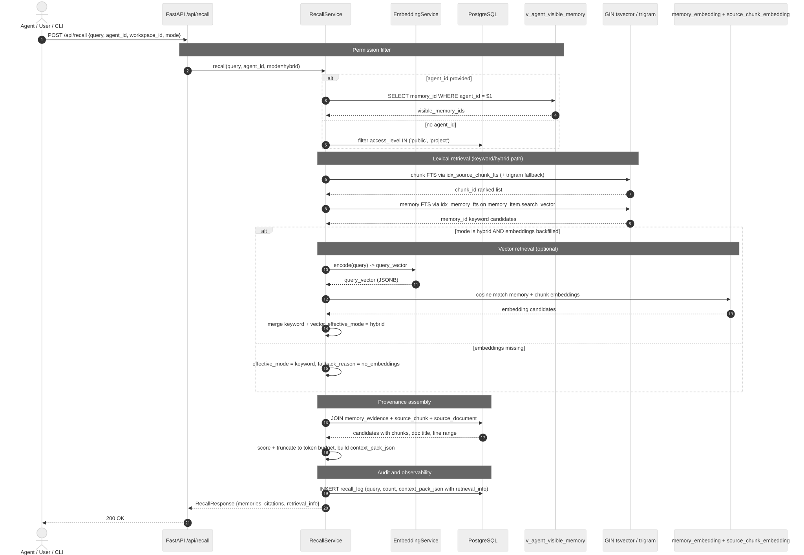

Recall 支持 keyword、vector、hybrid 三种模式。未配置 embedding 或没有 embedding records 时，hybrid 会透明降级到 keyword，并在 `retrieval_info` 中返回 requested mode、effective mode、candidate count 和 fallback reason。前端 Recall 页面默认使用 keyword 以保证 demo 稳定，后端 API 默认保留 hybrid 合约。

### 11.3 当前已实现的 AI 功能与边界

当前项目已经实现的 AI 相关能力，主要集中在“可选增强层”而不是“事实源主链路”：

1. `Memory Extraction` 支持两条候选抽取路径：默认 `rule_based`，以及 `method='llm'` 的 optional OpenAI-compatible analysis path。
2. 两条路径都会先写入 `memory_item(status='candidate')`，并绑定 `memory_evidence`、记录 `memory_extraction.run.start/complete` 审计事件；新候选不会直接进入默认 recall，仍需人工 approve / reject。
3. `Recall` 支持 keyword / vector / hybrid 三种模式；embedding 默认是本地 hashing cache，未配置外部 embedding provider 或没有匹配 embedding records 时，会透明 fallback 到 keyword。
4. `QA` 支持基于 recall context 的 optional LLM answer path；只有配置兼容 provider 后才启用，不影响离线 demo 主路径。
5. 前端 `Sources -> Source Detail` 已支持勾选 `Use LLM` 触发候选抽取；CLI 也提供 `mb extract --method llm` 入口。

这部分能力的设计边界也需要明确说明：

- 默认演示链路仍是本地可运行的 `rule_based extraction + keyword recall`，不依赖外部 API key。
- LLM 当前只参与“候选记忆草拟”和“可选 QA 回答”，不直接写入 `active` facts，也不绕过 evidence / approval / audit。
- 当前尚未实现更完整的 `analysis_run`、`analysis_memory_draft`、`analysis_draft_evidence` 草稿表工作流；optional LLM extraction 是在现有 candidate lifecycle 上的增强，而不是替代现有 schema。

### 11.4 Governance Lifecycle

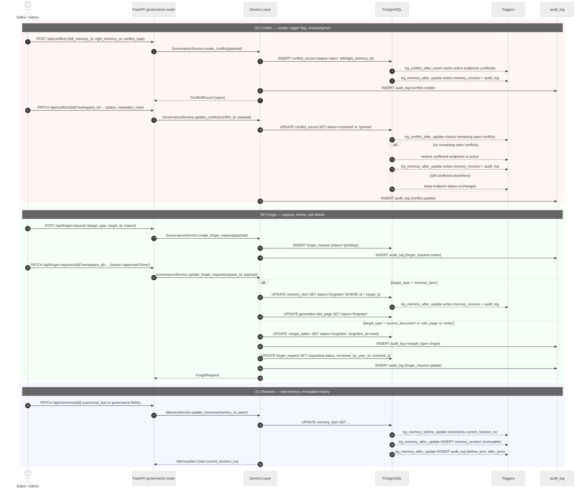

治理链路覆盖 memory update/delete、conflict create/resolve、forget request approve/verify、wiki revision 等事件。数据库触发器负责 revision、audit、soft delete 和 conflict status，同步到前端 governance 页面和 SQL demo 查询。

### 11.5 Memory 状态机


`memory_item.status` 当前支持 7 个状态：

```text
candidate -> active / rejected
active -> archived / forgotten / superseded / conflicted
conflicted -> active / superseded / forgotten
archived -> forgotten
```

状态转换由 service 校验，数据库 trigger 负责记录 revision 和 audit。

## 12. 系统演示

### 12.1 演示准备

```bash
npm run db:setup
```

该命令会重建 public schema，加载 `database/00_init.sql` 到 `database/07_seed.sql`，执行 search backfill，加载 `database/10_governance_demo_fixture.sql`，并运行 `database/08_demo_queries.sql`。演示数据包含 source、memory、evidence、revision、audit、wiki、policy、conflict、forget request 等对象。

### 12.2 演示路径

1. 打开 Dashboard，展示 workspace 统计。
2. 进入 Sources，展示 seeded discussion documents。
3. 打开 Source detail，查看 chunk 行号并选择待抽取的 chunk。
4. 先运行默认 rule-based candidate extraction，再勾选 `Use LLM` 运行 optional LLM extraction，对比候选类型与置信度。
5. 进入 Memories，展示 memory type/status/importance。
6. 打开 Memory detail，展示 evidence 和 revision。
7. 在 Recall 搜索“为什么放弃校园食堂系统”。
8. 生成 Context Pack，展示 Agent-ready Markdown。
9. 如配置 LLM provider，点击 Ask，展示 optional QA answer。
10. 展示 Governance：audit、policies、conflicts、forget requests、timeline。
11. 展示 Graph Explorer。
12. 展示 SQL 查询结果和 EXPLAIN 证据。

### 12.3 具体演示示例


#### 12.3.1 Source 详情、chunk 行号与候选抽取入口

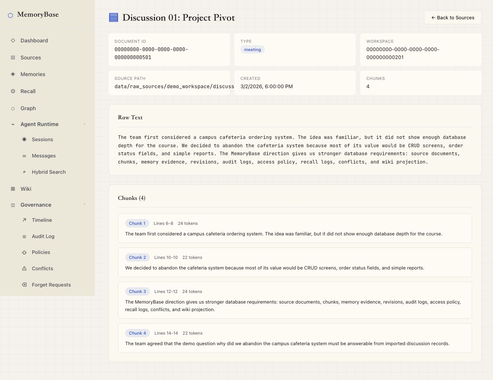

*图 12-1 Source detail 页面同时展示原始文本、chunk 行号，以及 `Use LLM` 候选抽取入口。*

这张图说明 source 导入后并不是黑盒切分；用户可以明确看到文档内容、chunk 的边界与行号，并在同一页面选择哪些 chunk 进入 candidate extraction 流程。

#### 12.3.2 Memory detail 的 evidence 与 revision

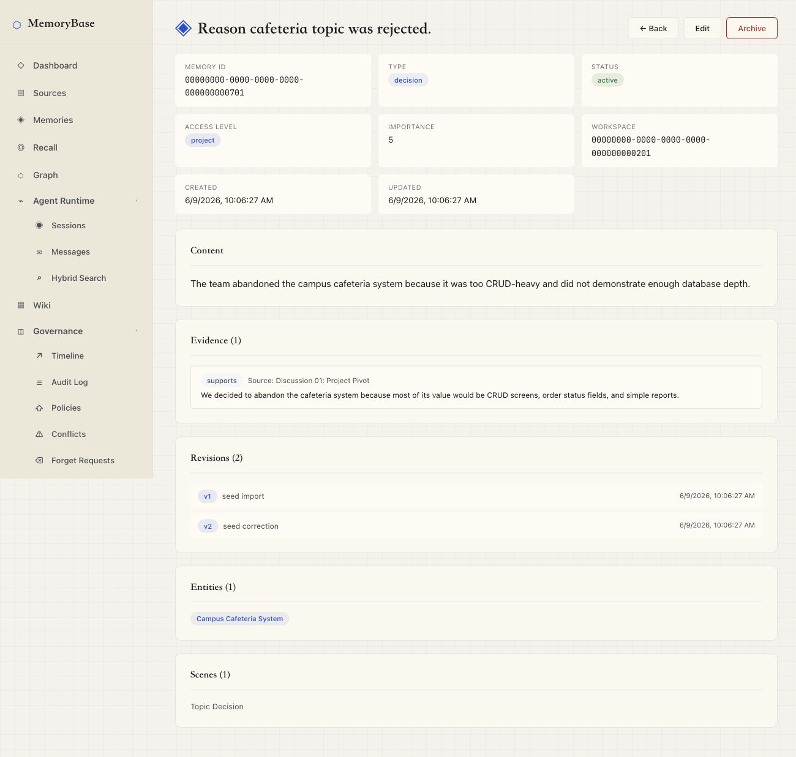

*图 12-2 Memory detail 页面展示 memory 内容、evidence、revision、entity 和 scene。*

这张图对应本系统“provenance-first”的核心设计：每条 memory 都能向下追溯到 source chunk，并能向后查看 revision 历史，而不是只保留一段不可解释的摘要文本。

#### 12.3.3 Recall 结果与 retrieval metadata

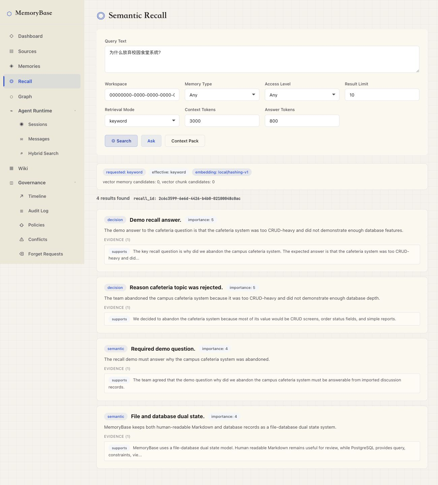

*图 12-3 Recall 页面返回与“为什么放弃校园食堂系统”相关的记忆结果，并显示 requested / effective retrieval mode。*

该图展示了数据库事实源上的 recall 能力：不仅返回答案相关 memory，还把 `retrieval_info` 暴露给前端，说明实际使用了什么检索模式，以及是否发生了 fallback。

#### 12.3.4 Context Pack 投影

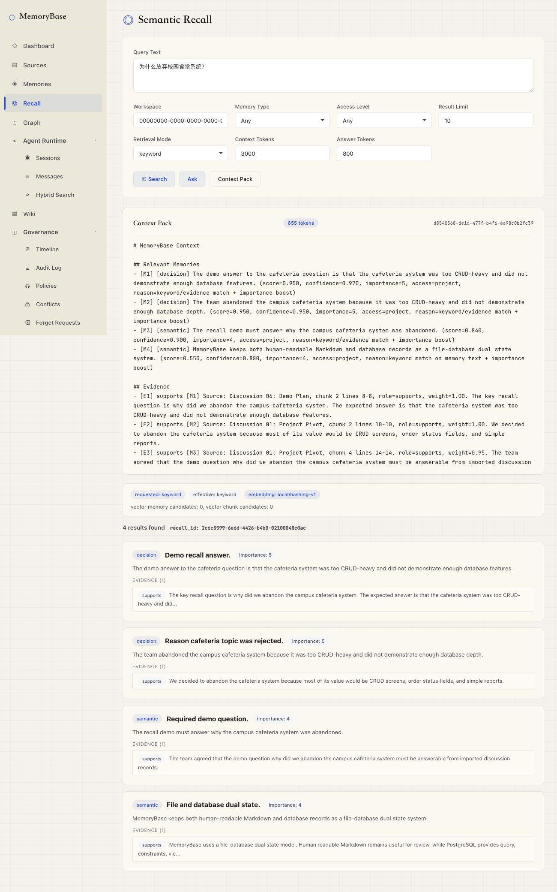

*图 12-4 Recall 结果可进一步投影为 Agent-ready Markdown Context Pack。*

这张图说明 Recall 并不止于“查到结果”，而是能够把 memory、evidence、citation 和 retrieval metadata 组织成可供 Agent 继续使用的上下文包。

#### 12.3.5 Optional LLM candidate extraction 对比

为验证 optional LLM extraction 的价值，我们对同一组三条 chunk 分别运行默认 rule-based 路径和 Qwen-compatible analysis path。

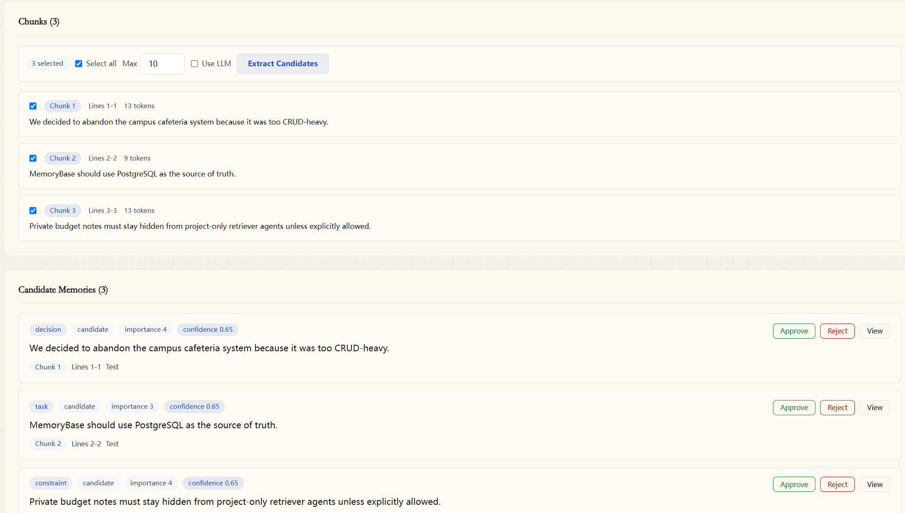

*图 12-5 默认 rule-based candidate extraction 结果。*

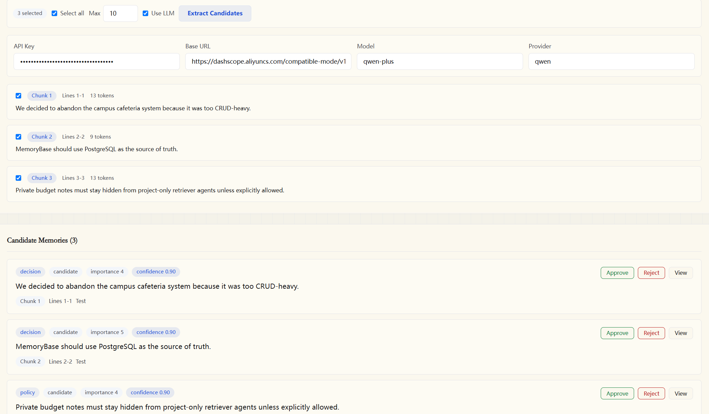

*图 12-6 启用 Qwen-compatible optional LLM extraction 后的结果。*

| Chunk 内容（缩写） | Rule-based 结果 | Qwen LLM 结果 |
|---|---|---|
| `abandoned cafeteria` | `decision`，confidence `0.65`，importance `4` | `decision`，confidence `0.90`，importance `4` |
| `PostgreSQL source of truth` | `task`，confidence `0.65`，importance `3` | `decision`，confidence `0.90`，importance `5` |
| `private budget notes hidden` | `constraint`，confidence `0.65`，importance `4` | `policy`，confidence `0.90`，importance `4` |

这组对比很好地验证了 rule-based 路径的局限与 optional LLM 路径的优势。第一句两条路径都能识别为 `decision`，但 LLM 给出了更高的 confidence；第二句没有再被 `should` 误判成 `task`，而是更准确地识别为架构 / 数据库方向的 `decision`；第三句也从较宽泛的 `constraint` 收敛为更贴近权限治理语义的 `policy`。同时，两条路径都只把结果写入 `status='candidate'`，仍然需要人工 approve / reject，因此语义增强并没有破坏 provenance、audit 和 human-in-the-loop 的主链路。

#### 12.3.6 Optional QA answer

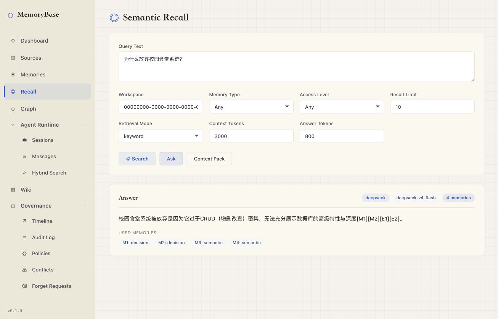

*图 12-7 配置 optional LLM provider 后，Recall 页面可直接生成带引用的回答。*

这里展示的是基于 recall context 的 optional QA path。它不是演示主链路所必需的能力，但在配置兼容 provider 后，可以把已召回的 memory 组织成最终回答，并显示使用的模型和 supporting memories 数量。

#### 12.3.7 Governance 冲突治理

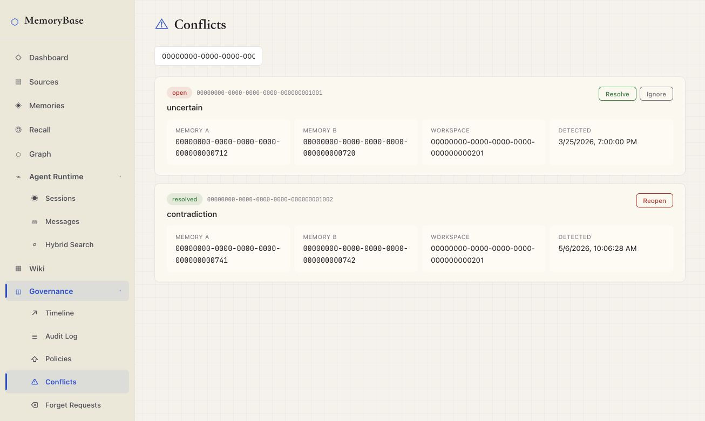

*图 12-8 Governance 页面展示 open / resolved conflict 的生命周期。*

这张图说明 conflict governance 并不是文档中的概念，而是落在了可浏览、可 resolve / ignore / reopen 的具体工作流中，并与后端 trigger / audit 逻辑对应。

#### 12.3.8 Graph Explorer

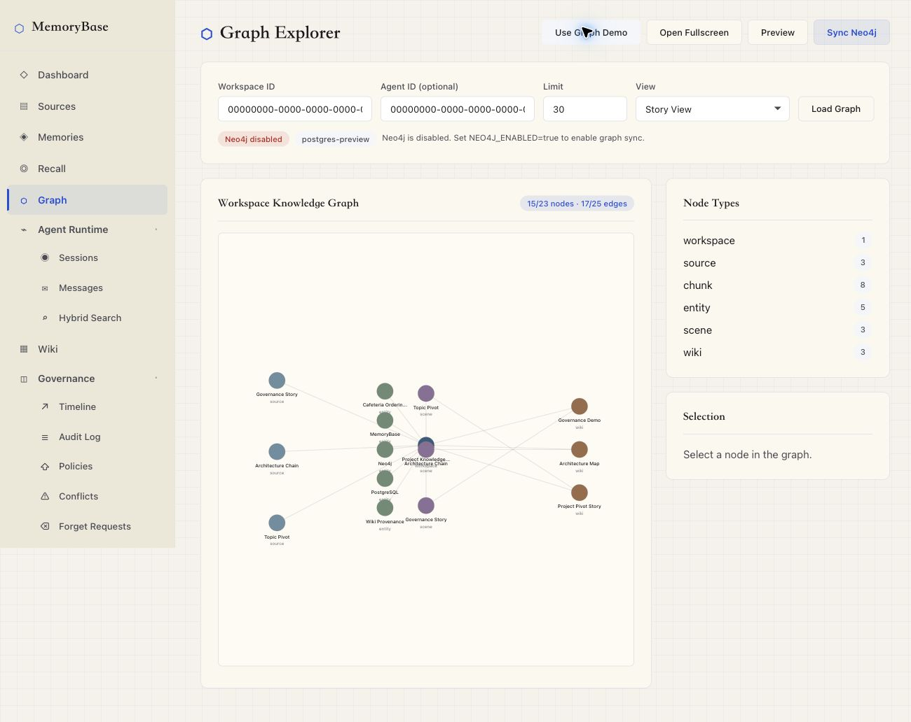

*图 12-9 Graph Explorer 基于 PostgreSQL 事实源渲染 workspace knowledge graph。*

该图一方面展示了 source、chunk、entity、scene、wiki 等节点的可视化关系，另一方面也清楚显示 Neo4j 是 optional 的；即使 Neo4j disabled，PostgreSQL preview 仍可独立完成图谱展示。

完整截图索引见 `docs/final-assets/screenshots/README.md`。

## 13. 测试与评估

### 13.1 自动化测试

当前测试覆盖：

| 类别 | 测试文件示例 | 覆盖目标 |
|---|---|---|
| API / service | `test_sources.py`、`test_memories.py`、`test_recall_query.py` | source、memory、recall |
| Governance | `test_governance.py`、`test_graph_service.py` | policy、audit、conflict、forget、graph visibility |
| CLI / Agent Runtime | `test_cli_context.py`、`test_cli_recall.py`、`test_cli_sessions.py`、`test_cli_writeback.py` | context、recall、observe、remember |
| Evaluation | `test_evaluation_*` | adapters、metrics、judging、checkpoint、report |
| PostgreSQL integration | `test_postgres_integration.py` | schema、seed、trigger、batch create、supersession |
| Frontend | `npm run lint`、`npm run build` | React lint 和 production build |

最终提交前推荐命令：

```bash
uv run ruff check backend/app backend/tests evaluation
uv run --with pytest python -m pytest backend/tests -q
cd frontend && npm run lint && npm run build
git diff --check
```

最近一次合并后的验证记录包括：

- `uv run ruff check backend/app backend/tests evaluation` 通过；
- `.venv/bin/python -m pytest backend/tests -q`：197 passed, 1 skipped；
- PostgreSQL batch/supersession focused integration tests：2 passed, 41 deselected。

### 13.2 SQL 演示测试

`database/08_demo_queries.sql` 提供课程演示 SQL，覆盖 provenance、agent visibility、audit/revision、conflict、forget、statistics、wiki sources 等路径。`docs/final-assets/screenshots/logs/` 保存完整命令输出，PNG/SVG 是从完整日志渲染得到，避免终端截图截断。

### 13.3 Evaluation 结果与解释

Evaluation framework 覆盖 datasets、adapters、metrics、runners 和 reports。当前已完成一次 LongMemEval oracle 500-case live `db_qa` 运行：

| Metric | Result |
|---|---:|
| Cases | 500 |
| API errors | 0 |
| Deterministic pass | 176 / 500 (35.2%) |
| Semantic judge pass | 292 / 500 (58.4%) |
| Semantic judge fail | 208 / 500 (41.6%) |

分类结果显示系统在 abstention、temporal_update、single_fact 上表现较好，在 multi_session reasoning 和 preference_following 上较弱。这一结果应作为工程验证和限制分析，而不是榜单宣传。MemoryBase 的主价值是：用数据库事实源、provenance、governance、agent visibility 和 audit 支撑长期记忆任务，并用 evaluation 暴露真实边界。

## 14. 创新点总结

### 14.1 DB-first AI substrate

MemoryBase 把 AI 长期记忆从模型或向量库的黑盒能力转化为 PostgreSQL 中可验证的关系模型。LLM、embedding、Graph 和 evaluation 都是围绕数据库事实源的增强层。

### 14.2 Provenance-first 证据链

`memory_evidence`、`v_memory_with_source`、`v_wiki_page_sources`、`recall_log.context_pack_json` 让系统能回答“这条记忆来自哪里”“这次 recall 用了哪些 memory”“Wiki 页面引用了哪些 source”。

### 14.3 Governance-by-default 生命周期

revision、audit、conflict、forget、policy 被设计为核心表和触发器逻辑，不是 UI 装饰。状态变更、软删除和冲突 lifecycle 都可被 SQL 验证。

### 14.4 Agent-aware visibility

Agent 不是普通用户别名，而是独立 principal。系统通过 `access_policy` 和 `v_agent_visible_memory` 把权限过滤放入数据库查询路径，而不是依赖 prompt 中的自律。

### 14.5 Transparent hybrid retrieval

系统支持 keyword/vector/hybrid recall，但不假装向量永远可用。无 embedding 时明确 fallback 到 keyword，并记录在 `retrieval_info` 和 `recall_log` 中。

### 14.6 AI-assisted candidate extraction

MemoryBase 先用 rule-based 路径交付了稳定的 candidate extraction，随后又增加了 optional LLM analysis path。两条路径都会把候选记忆写入 `memory_item(status='candidate')`，并绑定 evidence、记录 run-level audit。这样既避免了“LLM 直接写事实”的风险，也避免了“大量文档完全靠人工处理”的低效。

### 14.7 Graph as provenance visualization

Graph Explorer 用 PostgreSQL 构建 workspace graph，并可选同步 Neo4j。图层服务关系展示和 provenance 可视化，不替代 PostgreSQL 事实源。

### 14.8 Evaluation-backed validation

Evaluation framework 让系统不只做 UI demo，还能用 LoCoMo / LongMemEval / MemoryAgentBench 等基准检查长期记忆行为。当前低分项也帮助明确 future work。

## 15. 小组分工与个人完成情况

> 本节基于 `docs/gap6-contribution-ledger.md` 在 2026-06-14 的 Git commit 审计刷新。

| 成员 | 主要负责 | 交付成果 |
|---|---|---|
| 林纪帆 (hopecommon / jflin) | 数据库 schema、治理与溯源模型、lexical search / context-pack formatter / CLI dogfood、Graph hardening、审查合并/集成补强、最终报告证据资产 | SQL schema、views、triggers、indexes、seed/demo data；governance/provenance workflows；CLI recall/context/eval/sessions/observe/remember；Graph visibility/sync/audit hardening；ER/sequence diagrams；截图、final report 和 final defense slides |
| 杜卓轩 (dzx0902 / dzx) | P0 backend/tests、evaluation benchmark framework、LoCoMo / LongMemEval / MemoryAgentBench adapters、LongMemEval full-run evidence、embedding/hybrid recall、memory extraction、QA、CI/tooling | FastAPI 后端基础、测试体系、evaluation datasets/adapters/metrics/runners/reports、semantic judging、checkpoint/resume、embedding/cache/hybrid recall、batch memory write、supersession |
| 李昭成 (huiyijian / lywzc0419 / lzc) | 前端 API 集成、runtime/governance UI、多页面联调、Neo4j Graph Explorer 初版集成 | Dashboard、sources、memories、recall、governance、wiki、runtime、graph 等页面联调；graph API/service/model、Neo4j demo SQL、依赖配置和 lint/import 修复 |
| 王星睿 (Cofstars) | source extraction workflow、chunking/test additions、source UI creation/detail flow、optional LLM-backed candidate extraction、相关 CLI/API/tests、final report 与 PPT | source extraction candidate workflow；chunking 逻辑与测试；`SourceCreate.jsx` / `SourceDetail.jsx` 抽取交互；`backend/app/services/llm_analysis.py`；`mb extract` CLI；memory extraction API/service/tests；final report 与 final defense slides |

分工边界说明：recall/search/context pack 是协作模块。hopecommon 主要负责 lexical search、context-pack formatter 和 CLI/dogfood；dzx0902 主要负责 hybrid recall、embedding、QA 和 structured context metadata；Graph 初版由 lywzc0419 集成，后续 visibility/sync/audit hardening 由 hopecommon 完成；Cofstars 工作集中在 source extraction、optional LLM extraction、PPT 和报告。


## 16. 带注释源程序与附录
### 16.1 SQL 源程序

| 文件 | 内容 |
|---|---|
| `database/00_init.sql` | PostgreSQL extension 初始化 |
| `database/01_schema_core.sql` | 用户、workspace、agent、member |
| `database/02_schema_memory.sql` | session、source、chunk、memory、evidence、embedding、entity、scene |
| `database/03_schema_governance.sql` | wiki、timeline、recall log、policy、forget、conflict、audit |
| `database/04_indexes.sql` | B+ tree、GIN、BRIN、covering、partial index |
| `database/05_views.sql` | provenance、visibility、statistics、conflict、wiki source views |
| `database/06_triggers.sql` | revision、audit、soft delete、conflict lifecycle |
| `database/07_seed.sql` | demo seed |
| `database/08_demo_queries.sql` | 演示查询 |
| `database/09_graph_demo.sql` | optional graph demo data |
| `database/10_governance_demo_fixture.sql` | governance fixture |

### 16.2 高级语言源程序

| 目录 / 文件 | 内容 |
|---|---|
| `backend/app/main.py` | FastAPI app 和 router 挂载 |
| `backend/app/api/` | HTTP API |
| `backend/app/services/` | 核心业务逻辑 |
| `backend/app/cli/` | `mb` / `memorybase` CLI |
| `frontend/src/` | React 前端 |
| `evaluation/` | benchmark adapters、metrics、runners、reports |
| `backend/tests/` | 测试 |

详细源码清单和建议摘录见 `docs/gap8-source-sql-appendix-map.md`。

## 17. 总结与展望

MemoryBase 完成了一个工程上可运行、演示闭环清晰的组织级长期记忆系统。它把 AI memory 从“聊天产品里的黑盒功能”转化为 PostgreSQL 中可建模、可约束、可审计、可追溯、可被 Agent 调用的数据库应用。

已完成的核心价值：

- 完整的 source -> memory -> evidence -> revision -> audit -> wiki 链路；
- 关系模型、E-R、范式、物理设计和 SQL 源程序齐全；
- B+ tree、GIN、BRIN、covering index 等索引策略有 EXPLAIN 证据；
- governance、provenance、agent visibility 是 schema 级能力；
- 前端、后端、CLI、evaluation 和截图证据形成可演示系统。

当前边界：

- 自动抽取已支持 rule-based 和 optional LLM 两条路径，但还不是完整的 LLM analysis draft-table workflow；
- JSONB embedding cache 适合课程规模，不替代大规模 pgvector / ANN；
- LongMemEval 结果适合作为工程验证，不适合作为高分榜单 claim；
- memory-level visibility 已实现，source/wiki 的更细粒度策略仍可扩展；
- Graph Explorer 是 provenance 可视化，不是默认 GraphRAG 检索主路径。

未来的可能拓展方向：

1. 引入 pgvector / HNSW / IVFFlat 支撑大规模向量检索；
2. 引入 LLM-backed `analysis_run` / `analysis_memory_draft` / `analysis_draft_evidence` 草稿表；
3. 扩展 source/wiki resource policy，形成更完整的多租户治理；
4. 增强 temporal reasoning、multi-session reasoning 和 preference following；
5. 完善 LoCoMo / MemoryAgentBench 对照实验和独立 judge；
6. 扩展 Obsidian/Git 双向同步和多 Agent 自动协作。

## 参考资料

- Lewis et al., Retrieval-Augmented Generation for Knowledge-Intensive NLP Tasks, 2020.
- Park et al., Generative Agents: Interactive Simulacra of Human Behavior, 2023.
- Zhong et al., MemoryBank: Enhancing Large Language Models with Long-Term Memory, 2023.
- Packer et al., MemGPT: Towards LLMs as Operating Systems, 2023.
- Maharana et al., LoCoMo / Evaluating Very Long-Term Conversational Memory of LLM Agents, 2024.
- Wu et al., LongMemEval: Benchmarking Chat Assistants on Long-Term Interactive Memory, 2024.
- Chhikara et al., Mem0: Building Production-Ready AI Agents with Scalable Long-Term Memory, 2025.
- Hu et al., MemoryAgentBench, 2025.
- Edge et al., From Local to Global: A Graph RAG Approach to Query-Focused Summarization, 2024.
- PostgreSQL Documentation, B-Tree, GIN, BRIN, Generated Columns, PL/pgSQL Triggers.
- Atlassian Rovo / Confluence AI documentation.
- OpenAI Help Center, Memory FAQ.
- Letta, LangChain, LlamaIndex, Notion, Obsidian documentation.
